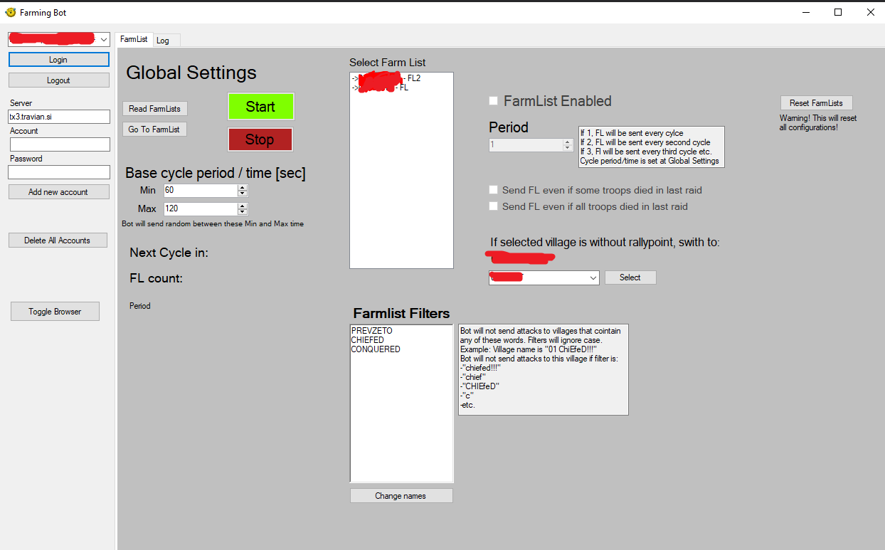

## Travian T4.5 Farmer bot
##### Features
- Random delay
- Configurable period for each FL
- Sound alert if chaptcha appears
- Will switch village if there is no rally point (eg. new village was settled)
- Will not farm villages that contains the template words in their name (eg. chiefed)
- Configurable option to also farm based on last report (eg. only attack when no losses, attack even if some losses, attack even if all losses)
- Sqlite DB for saving FL configuration and accounts

##### Screenshot of the bot

##### Setup
There has to be a **Accounts.sqlite** and **alert.wav** files (found in /data folder) inside the folder of the application. Bot will create new SQLite DB for each account you add. If I were do add new features, first thing would be to change from using raw SQL scripts to using EntityFramework. 